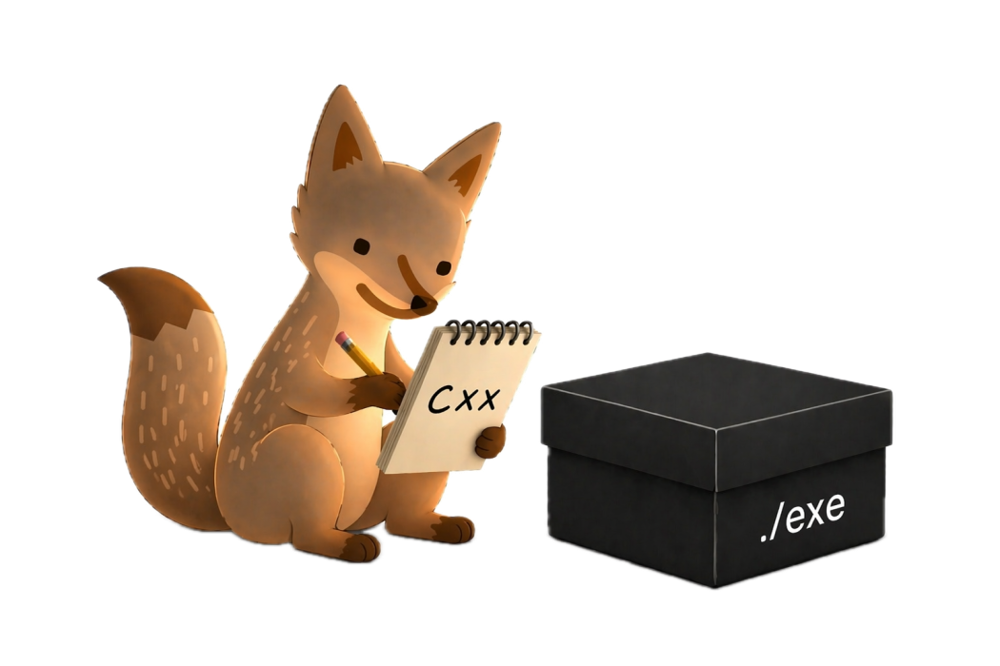

<p align="center">
  
</p>

<h1 align="center">ProgramBench</h1>

<p align="center"><em>Can language models rebuild black-box software systems?</em></p>

<p align="center">
Given only a compiled binary and its documentation, agents must architect and implement a complete codebase that reproduces the original program's behavior.
</p>

## Links

- [Website](https://programbench.com)
- [Documentation](https://programbench.com/more)
- [Paper](https://programbench.com) (coming soon)
- [HuggingFace](https://programbench.com) (coming soon)
- [Leaderboard](https://programbench.com)

## Quickstart

We recommend [uv](https://docs.astral.sh/uv/getting-started/installation/) for managing Python environments.

```bash
# Run without installing
uvx programbench --help

# Or install into a project
uv pip install programbench

# Or with pip
pip install programbench
```

For development:

```bash
git clone https://github.com/gnever-reveng/programbench.git
cd programbench
uv sync  # installs editable + dev dependencies
```
